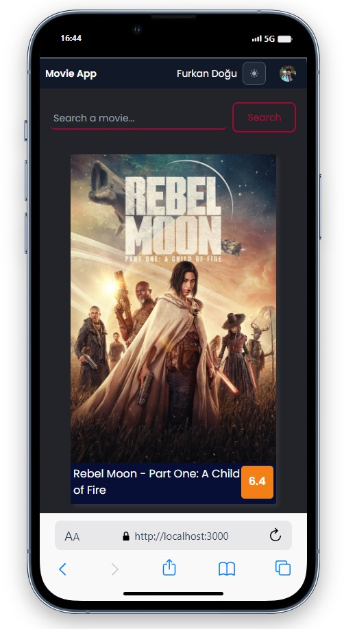

# Movie App

<div align="center">
  
</div>

## About the Project

This project, created with React, includes a web application where you can register or log in with your own email or Google account. It is used to obtain information about movies and TV shows, and to view reviews

## Table of Contents

- [Features](#features)
- [Technologies Used](#technologies-used)
- [Usage](#usage)
- [Project Skeleton](#project-skeleton)
- [Screenshots](#screenshots)

## Live Demo

[Movie App](https://react-weather-app-omega-pink.vercel.app/)

## Features

- User registration via email or Google account.
- Password reset functionality.
- Light and dark mode based on user preference.
- Pagination for smooth transitions between pages.
- Easy movie search using the filtering feature.

## Technologies Used

- React
- Axios for API requests
- React-Router-Dom
- [TMDB API](https://www.themoviedb.org/) for movies data
- [Firebase](https://firebase.google.com/) for register and login processes
- Styling with Tailwind and CSS 
- [React-Toastify](https://fkhadra.github.io/react-toastify/introduction/) for alert 

## Usage

- Register or log in with your email or Google account.
- Explore information about popular movies and TV shows.
- Access detailed information and reviews for each item.
- Utilize the search functionality to locate specific movies or TV shows.

## Project Skeleton

```
Movie App (folder)
|
|----readme.md         
SOLUTION
├── public
│    └── index.html
├── src
│    ├── assets
│    │     ├── icons
│    │     └── images
│    ├── auth
│    │     └── firebase.js
│    ├── components
│    │     ├── MovieCard.jsx
│    │     ├── Navbar.jsx
│    │     ├── Switch.jsx    
│    │     └── VideoSection.jsx  
│    ├── context
│    │     ├── AuthContext.js
│    │     └── MovieContext.js 
│    ├── helpers
│    │     └── ToastNotify.js
│    ├── pages
│    │     ├── Login.jsx
│    │     ├── Main.jsx
│    │     ├── MovieDetail.jsx    
│    │     └── Register.jsx 
│    ├── router
│    │     ├── AppRouter.jsx
│    │     └── PrivateRouter.jsx
│    ├── App.js
│    ├── index.css
│    └── index.js
├── package.json
└── yarn.lock
```

## Screenshots

<div align="center">
  
  
  
</div>

## Compatibility

The project is compatible with both wide-screen computers and mobile devices.

## Acknowledgments

Movies data provided by [TMDB](https://www.themoviedb.org/)
